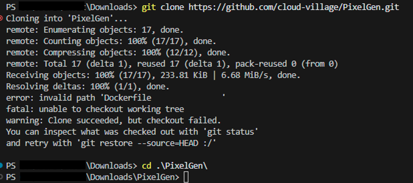
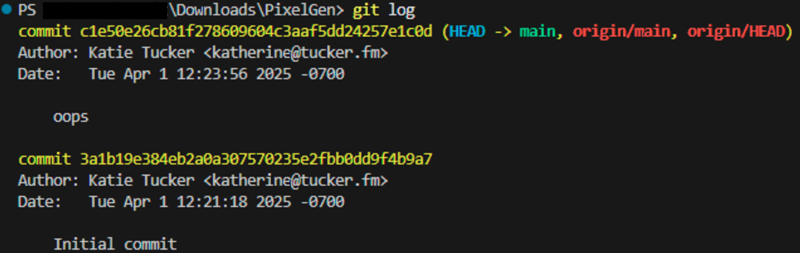
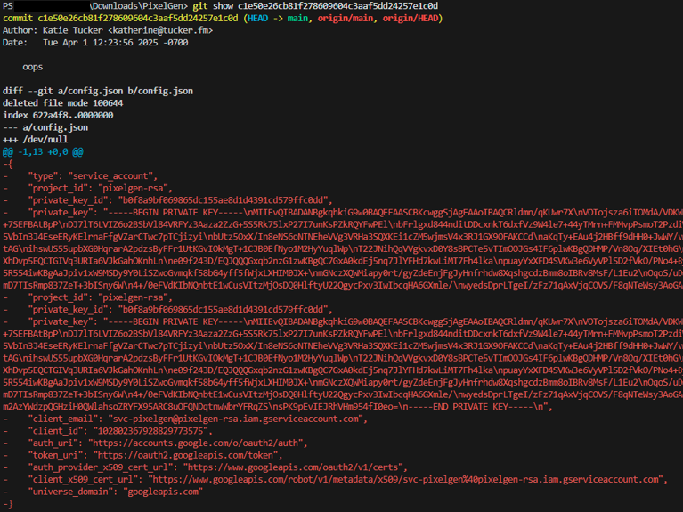
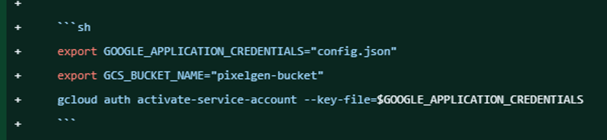
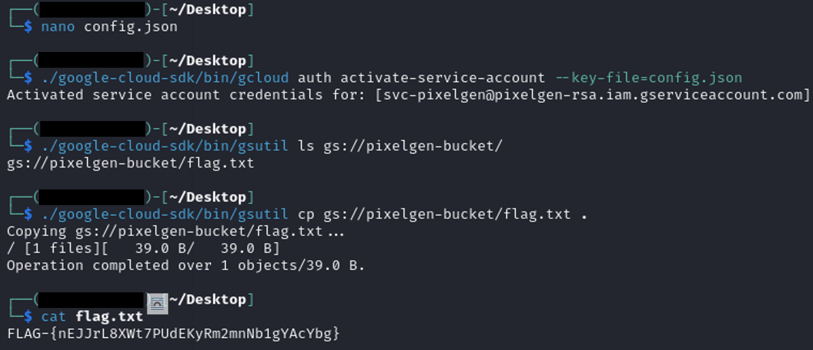

### PixelGen

**Description**  
PixelGen Cloud was built to bring modern images into the 8-bit era, turning photos into pixel-perfect sprites for an upcoming retro game. https://github.com/cloud-village/PixelGen Hint 1 (Cost: 0 points) Developers sometimes commit secrets by accident. Hint 2 (Cost: 0 points) Look at the git history. Hint 3 (Cost: 0 points) You will need to browse a google storage bucket. Can you find the name of the bucket?

---

#### **Solution Steps:**

I started the challenge by reading the description of PixelGen, a project that converts photos into pixel-perfect sprites for retro games. The hints suggested that secrets might have been accidentally committed to the repository, and I would need to check the git history and eventually a Google Cloud Storage bucket.

So, the first thing I did was clone the repository and inspect its history:

```bash
git clone https://github.com/cloud-village/PixelGen.git
cd PixelGen
git log
```





Looking through the commit messages, one of them immediately caught my eye and it was labeled “oops.” That felt like a clue, so I decided to dig deeper using:

```bash
git show c1e50e26cb81f278609604c3aaf5dd24257e1c0d
```


Inside this commit, I found environment variable exports pointing to a ```config.json``` and a bucket named ```pixelgen-bucket```. It also included a command to activate a Google service account:

```bash
export GOOGLE_APPLICATION_CREDENTIALS="config.json"
export GCS_BUCKET_NAME="pixelgen-bucket"
gcloud auth activate-service-account --key-file=$GOOGLE_APPLICATION_CREDENTIALS
```


I realized that the service account key might allow me to access the bucket. At first, I tried listing the bucket anonymously:

```bash
gsutil ls gs://pixelgen-bucket/
```
But I got an ```AccessDenied``` error, confirming that the bucket existed but wasn’t publicly listable. Then I remembered that the service account key was actually present in the deleted ```config.json``` file in the git history. Using ```git show``` and the diff, I recreated ```config.json``` with the service account credentials.

Next, I installed the Google Cloud SDK so I could authenticate and interact with the bucket:

```bash
curl -O https://dl.google.com/dl/cloudsdk/channels/rapid/downloads/google-cloud-sdk-460.0.0-linux-x86_64.tar.gz
tar -xf google-cloud-sdk-460.0.0-linux-x86_64.tar.gz
./google-cloud-sdk/install.sh
```

After installing, I initialized the SDK and activated the service account:

```bash
./google-cloud-sdk/bin/gcloud init
./google-cloud-sdk/bin/gcloud auth activate-service-account --key-file=config.json
```

Once authenticated, I could finally list the contents of the bucket:

```bash
./google-cloud-sdk/bin/gsutil ls gs://pixelgen-bucket/
```

This revealed a single file: ```flag.txt```. I downloaded it using:

```bash
./google-cloud-sdk/bin/gsutil cp gs://pixelgen-bucket/flag.txt .
```

Opening the file revealed the flag and successfully completed the challenge.
