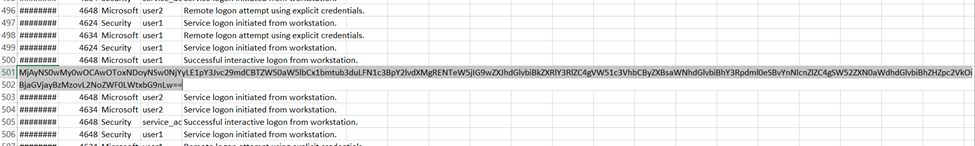
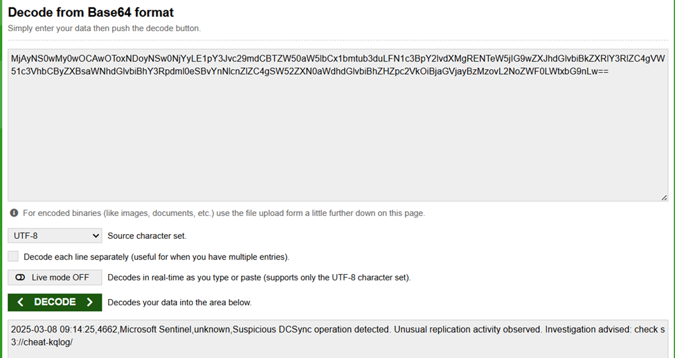
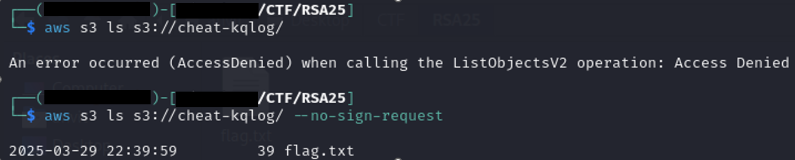
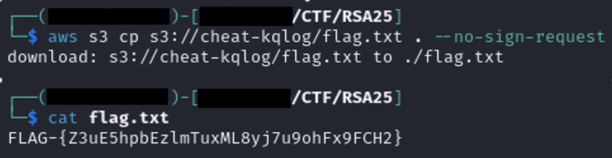

### The Cheat in the KQLog

**Description**  
During a scheduled threat-hunting minigame, a security analyst noticed something strange in the event logs of the mainframe. The patterns looked routine—until a pixel out of place revealed a glitch in the matrix.

Someone had tried to cover their tracks. They almost got away with it.

Now it’s your turn to pick up the controller. Can you spot the misstep, trace the trail, and unlock the hidden flag before the clock runs out?

Insert coin to begin.

Hint 1 (Cost: 0 points)
Pay close attention to suspicious log entries — even a single line could change everything.

Hint 2 (Cost: 0 points)
Some logs hide more than they show. Try decoding.

Hint 3 (Cost: 0 points)
Once you find a bucket, dig into its contents.

---

#### **Solution Steps:**

I started by opening the provided log file, which had 1,001 entries. My first step was to scan through it to identify anything unusual such as null or malformed rows, strange User or EventID values or descriptions that might be encoded or obfuscated.

While scrolling through, I found a very suspicious entry at index 499. Unlike the other rows, this one had a Timestamp field containing a very long, comma-separated string that looked out of place. All the other fields (EventID, Source, User, Description) were missing, which made it stand out immediately.

That long string seemed like it could be Base64, so I decoded it. The decoded output revealed a proper log line:





```
2025-03-08 09:14:25,4662,Microsoft Sentinel,unknown,Suspicious DCSync operation detected. Unusual replication activity observed. Investigation advised: check s3://cheat-kqlog/
```

The decoded message pointed me toward an S3 bucket named cheat-kqlog. I tried listing its contents with the AWS CLI using:

```bash
aws s3 ls s3://cheat-kqlog/
```

This gave me an “AccessDenied” error, which suggested that the bucket existed but wasn’t publicly listable by default. I retried the command with the --no-sign-request flag to check for public access:

```bash
aws s3 ls s3://cheat-kqlog/ --no-sign-request
```

This time, the command worked and revealed a file named flag.txt. I downloaded it using:


```bash
aws s3 cp s3://cheat-kqlog/flag.txt . --no-sign-request
```

After opening the file locally, I had the flag.



