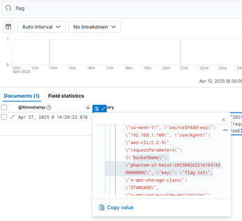
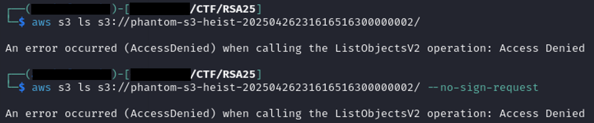
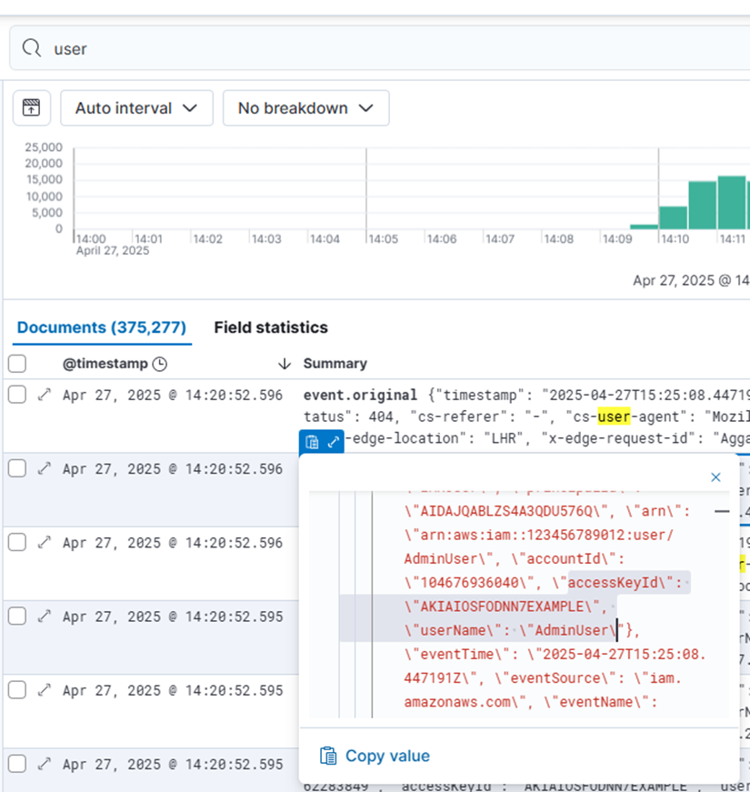
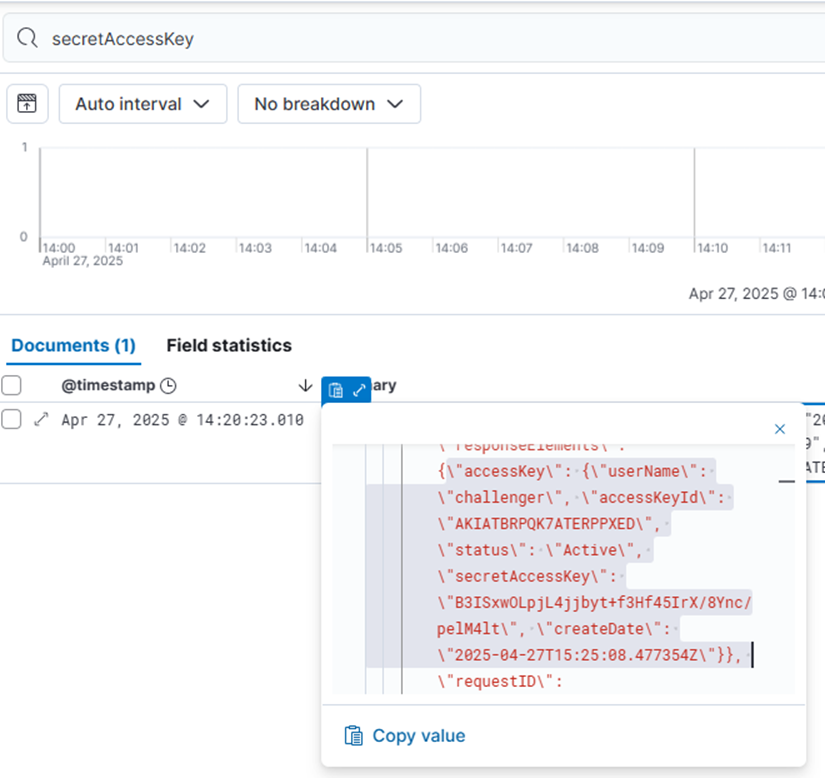
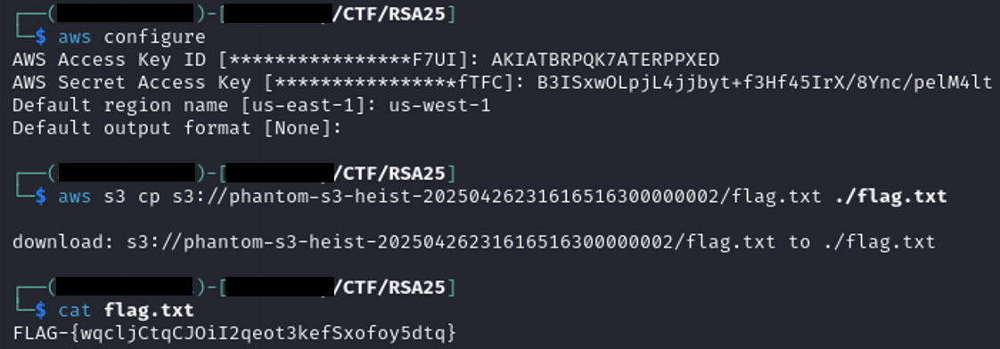

### The Phantom S3 Heist

**Description**  
After Phantom's latest game drop, a misconfigured ELK stack was left wide open—logging everything without redaction. Somewhere in those logs: leaked IAM creds and the path to a hidden S3 bucket.

Your mission? Trace the attacker’s steps, find the creds, and break into the bucket to steal the ultimate flag.

Game on. ?

Username: elastic Password: c8PBcuDi8K7feZ7Wg*sf

http://13.52.35.182:5601/
Hint 1 (Cost: 0 points)
The trail begins with whispers—search for the words they dared not hide: “flag,” “secret,” and more. These traces will reveal what was never meant to be seen.

Hint 2 (Cost: 0 points)
Though the vault’s entrance appears sealed, a backdoor may remain open. Listing the treasures may be forbidden... but what if you already knew what to ask for?

---

#### **Solution Steps:**

The challenge description mentioned a misconfigured ELK stack that was logging sensitive data without redaction. I was given credentials to log into Kibana at http://13.52.35.182:5601/ with:


```
Username: elastic
Password: c8PBcuDi8K7feZ7Wg*sf
```

Once inside, I started by searching for high-value keywords such as flag and secret. This quickly revealed a log entry indicating that someone had uploaded a file named flag.txt to an S3 bucket called:



```phantom-s3-heist-20250426231616516300000002```

The log also included the region us-west-1 and showed the event type as s3:PutObject, which confirmed that the file had been recently placed there.

My first move was to try listing the bucket contents using:

```bash
aws s3 ls s3://phantom-s3-heist-20250426231616516300000002/
```


This failed with “AccessDenied,” and even using --no-sign-request didn’t help. Since public access wasn’t allowed, I suspected that the leaked logs might also contain AWS credentials.

I searched Kibana again, this time for the keyword user, and found an AWS Access Key ID. 



Then I searched for secretAccessKey and found the matching AWS Secret Access Key. 



With both pieces of information, I configured my AWS CLI:

```bash
aws configure
```

I entered the Access Key, Secret Key, and set the region to us-west-1. With valid credentials configured, I could now copy the flag from the bucket:

```bash
aws s3 cp s3://phantom-s3-heist-20250426231616516300000002/flag.txt ./flag.txt
```

Opening the downloaded file revealed the flag and completed the challenge.



