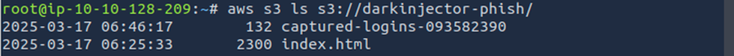

### Cloud Sanity Check

**Description**  


#### **Solution Steps:**

I started by attempting to list the contents of the suspected bucket using the AWS CLI:

```bash
aws s3 ls s3://darkinjector-phish/ --no-sign-request
```


The ```--no-sign-request``` flag allows anonymous access, which is crucial for testing public exposure. The command returned two files:

```captured-logins-093582390 (132 bytes)``` — likely a credentials dump

```index.html (2300 bytes)``` — probably the phishing page itself

This shows the AWS CLI output listing both files, confirming the bucket’s public accessibility and the presence of potentially sensitive data.

I downloaded the credentials file:

```bash
aws s3 cp s3://darkinjector-phish/captured-logins-093582390 .
```


Then, I inspected its contents:

```bash
cat captured-logins-093582390
```


The file contained a list of victim usernames and passwords in a single line with the flag.

```THM{this_is_not_what_i_meant_by_public}```