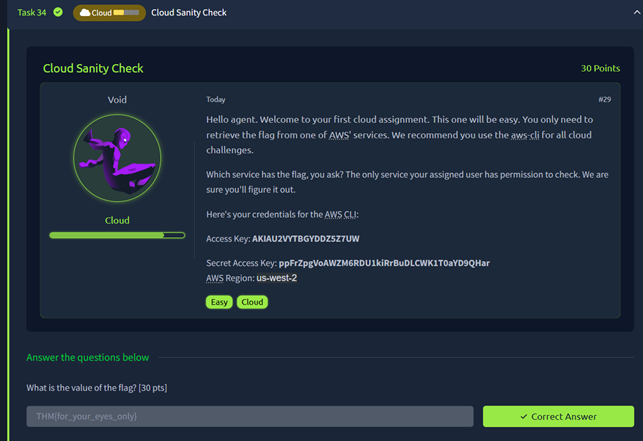
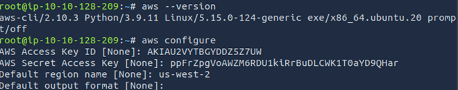
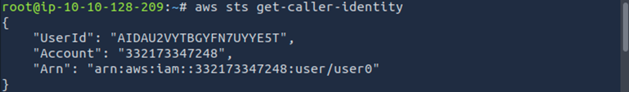
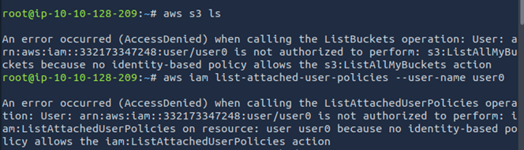
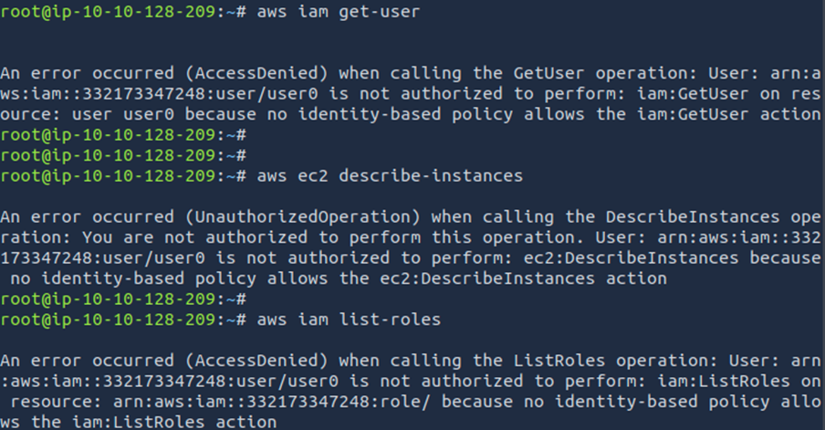
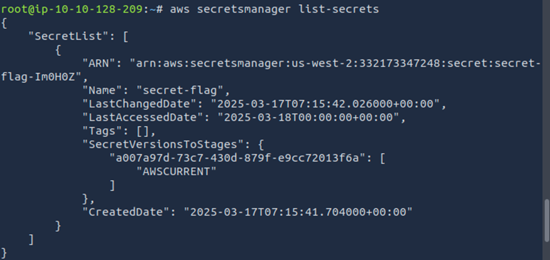
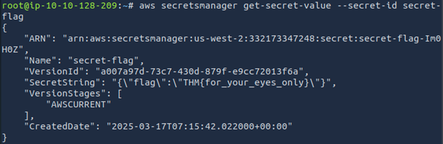

### Cloud Sanity Check

**Description**  



#### **Solution Steps:**
I started by configuring the AWS CLI with the provided credentials:

```bash
aws configure
```


This step ensures all commands use the correct access keys and region.

Step 2: Identity and Permission Enumeration
To understand what the IAM user could access, I ran:

```bash
aws sts get-caller-identity
```


This command confirmed my user’s ARN and account ID, which is essential for tracking the privilege boundaries.

Next, I checked for attached policies and roles:

```bash
aws iam list-attached-user-policies --user-name <username>
aws iam list-roles
```



The output showed that my user had limited direct policies but could enumerate roles, a sign of possible privilege escalation paths.

Step 3: Brute-Force Permission Discovery
Since AWS permissions can be granular, I used safe “list” and “get” API calls to brute-force what services I could access. For example:

```bash
aws secretsmanager list-secrets
aws iam get-user
aws ec2 describe-instances
aws iam list-roles
```



Only the ```secretsmanager list-secrets``` command succeeded and revealed a secret named secret-flag. This is a classic enumeration technique: try as many read-only API calls as possible and note which ones succeed.​

Step 4: Secrets Manager Extraction
With the secret name in hand, I got its value:

```bash
aws secretsmanager get-secret-value --secret-id secret-flag
```


The output JSON contained a SecretString field, which had the flag.

Step 5: Final Flag
After extracting the secret, the flag was:

```THM{for_your_eyes_only}```