### Encrypted Data

#### **Solution Steps:**

I started by configuring the AWS CLI with the provided credentials:

```bash
aws configure
```
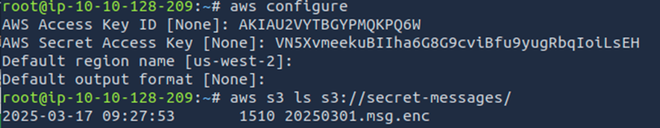

I listed available secrets and downloaded the encrypted file from AWS (e.g., S3 or Secrets Manager):

```bash
aws s3 ls s3://secret-messages/
aws s3 cp s3://secret-messages/20250301.msg.enc ./20250301.msg.enc
```

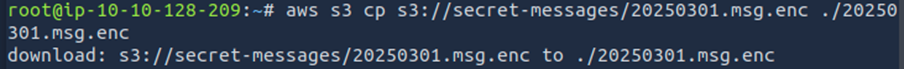

I checked the file type and previewed its contents:

```bash
file 20250301.msg.enc
hexdump -C -n 20 20250301.msg.enc
cat 20250301.msg.enc
```

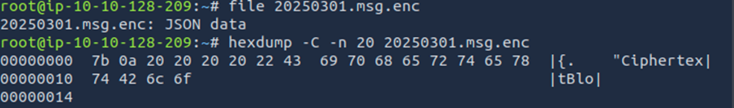
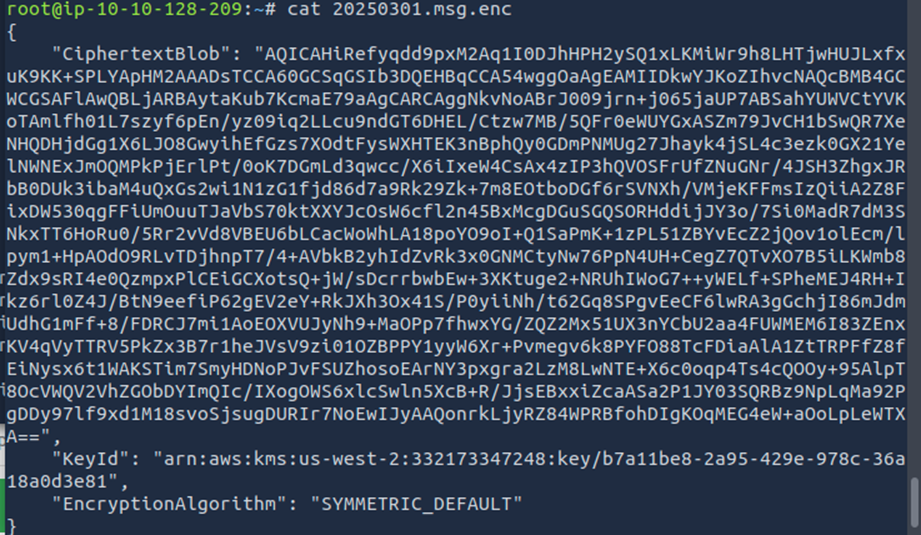

This confirmed it was a binary ciphertext blob.

Then I listed all the IAM roles available in the AWS account to understand which privileged roles might be usable:

```bash
aws iam list-roles
```
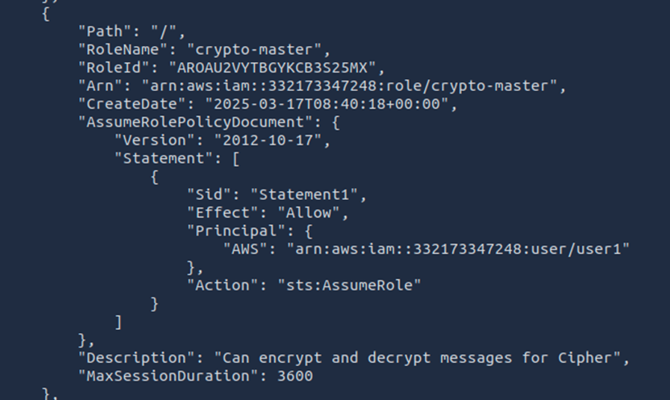

The output included several roles, one of which stood out as potentially having encryption privileges:

```crypto-master```

This shows the the presence of the crypto-master role amid other generic roles and indicated a possible elevated privilege account.

To assume the role and obtain temporary credentials, I ran:

```bash
aws sts assume-role \
  --role-arn arn:aws:iam::332173347248:role/crypto-master \
  --role-session-name decrypt-session
```
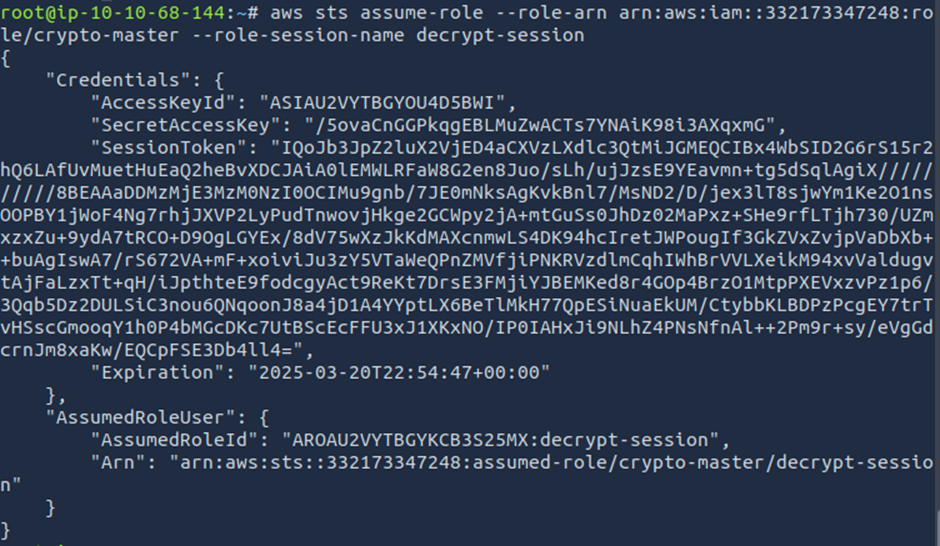

This returned temporary security credentials (AccessKeyId, SecretAccessKey, SessionToken), allowing privileged API access.

I configured my CLI session to use these temporary credentials:

```bash
export AWS_ACCESS_KEY_ID=...
export AWS_SECRET_ACCESS_KEY=...
export AWS_SESSION_TOKEN=...
```

This screenshot captures the ```assume-role``` command execution and the resulting JSON response containing temporary credentials, which permitted decryption operations.

Before decrypting, I identified the KMS key used for encryption:

```bash
aws kms describe-key --key-id <key-id>
```
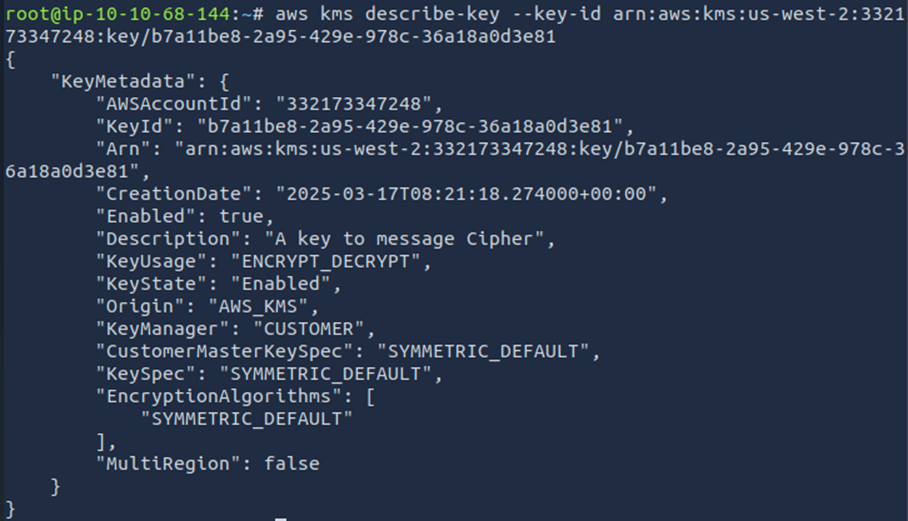
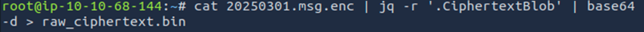
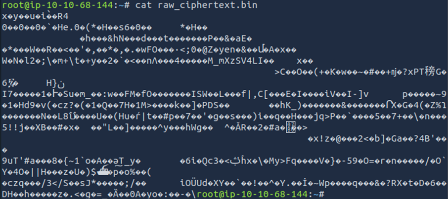

This command provided details about the key, such as its ARN, usage, and state, confirming it was enabled and suitable for decryption and also shows how I parsed the JSON, isolated the actual ciphertext and decoded it to a raw binary suitable for the next step. This is crucial—unless you extract the pure ciphertext, KMS decryption won't work

Using the KMS decrypt operation:

```bash
aws kms decrypt --ciphertext-blob fileb://encrypted_blob --output text --query Plaintext | base64 --decode > dec_message.txt
```
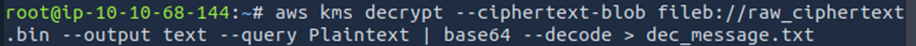
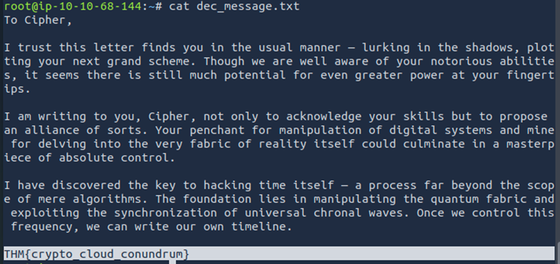

This shows the successful decryption command and the base64-decoded plaintext output, revealing the secret flag.

The decrypted plaintext contained the flag:

```THM{crypto_cloud_conundrum}```