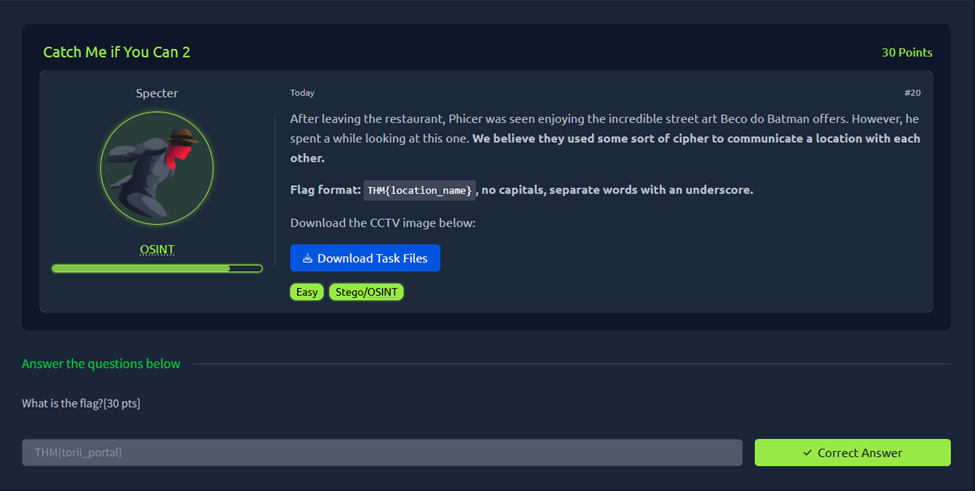
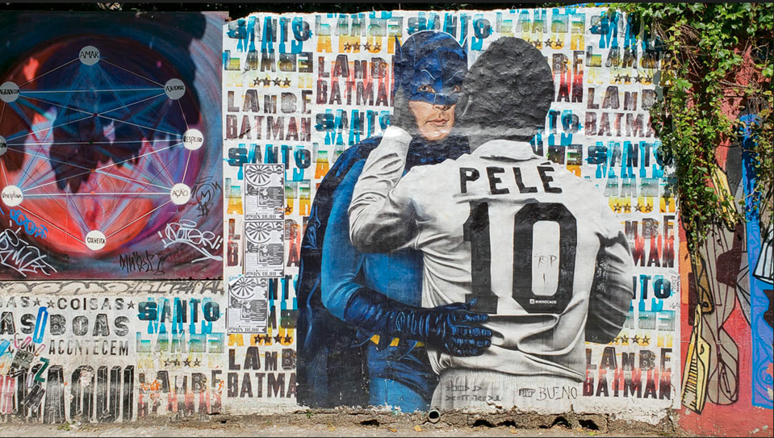
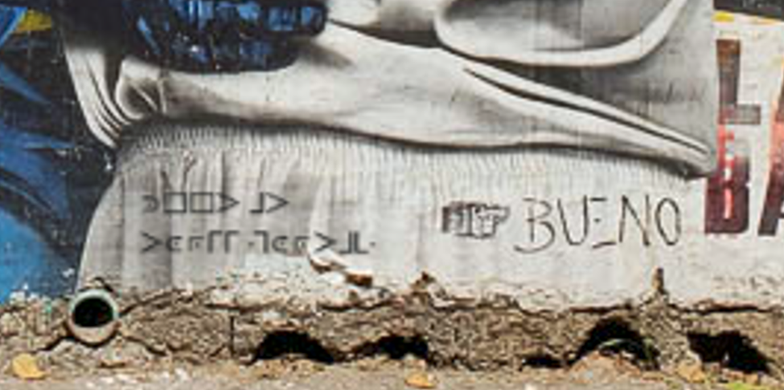
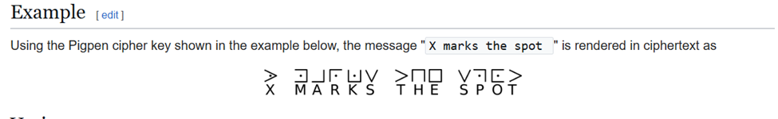

### Catch Me if You Can 2



#### **Solution Steps:**



I found some kind of symbols and uploaded it on google images and came to know that those symbols are nothing but some text that is encrypted using the pigen cipher






So after decrypting I got the text ```meet at torii portal```.

Flag: ```THM{torii_portal}```